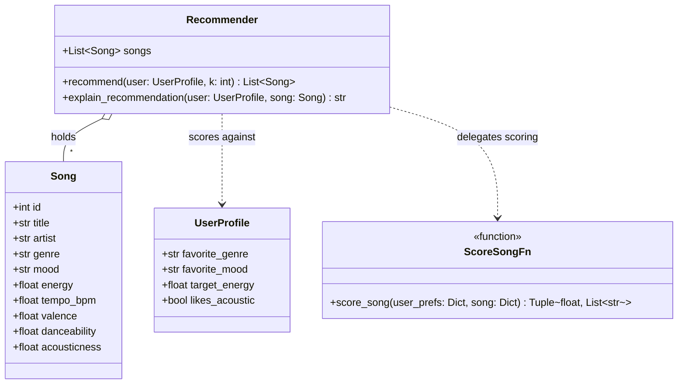
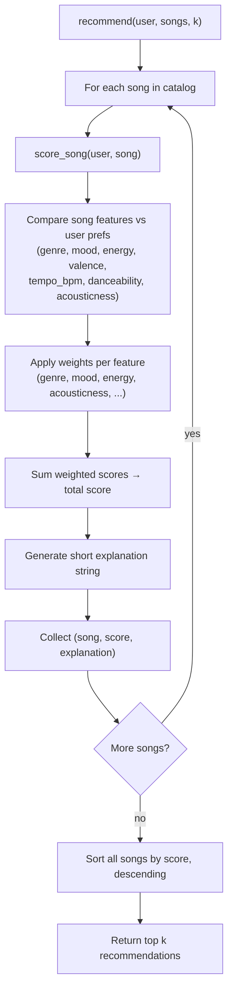

# 🎵 Music Recommender Simulation

## Project Summary

In this project you will build and explain a small music recommender system.

Your goal is to:

- Represent songs and a user "taste profile" as data
- Design a scoring rule that turns that data into recommendations
- Evaluate what your system gets right and wrong
- Reflect on how this mirrors real world AI recommenders

Replace this paragraph with your own summary of what your version does.

---

## How The System Works

Each `Song` carries five core numeric features — `energy`, `tempo_bpm`, `valence`, `danceability`, and `acousticness` — plus `genre` and `mood` tags used for categorical matching.

Each `UserProfile` stores a listener's taste as `favorite_genre`, `favorite_mood`, a `target_energy` value, and a `likes_acoustic` flag.

The `Recommender` scores every song against a user profile with a weighted rule:

- **Genre match**: a bonus if the song's `genre` equals the user's `favorite_genre`.
- **Mood match**: a bonus if the song's `mood` equals the user's `favorite_mood`.
- **Energy fit**: the closer the song's `energy` is to the user's `target_energy`, the higher the score (distance-based penalty).
- **Acousticness fit**: rewards high `acousticness` when `likes_acoustic` is true, and low `acousticness` otherwise.
- **Other features** (`valence`, `danceability`, `tempo_bpm`): smaller weighted contributions that nudge the score without dominating it.

Each weighted component also produces a short piece of text (e.g. `"matches favorite genre"`, `"energy close to target"`), which are joined into the explanation returned by `explain_recommendation`.

To choose recommendations, the system scores every song in the catalog this way, sorts all songs by total score in descending order, and returns the top `k`.

**Class structure:**



**Scoring and recommendation flow:**



---

## Getting Started

### Setup

1. Create a virtual environment (optional but recommended):

   ```bash
   python -m venv .venv
   source .venv/bin/activate      # Mac or Linux
   .venv\Scripts\activate         # Windows

2. Install dependencies

```bash
pip install -r requirements.txt
```

3. Run the app:

```bash
python -m src.main
```

### Running Tests

Run the starter tests with:

```bash
pytest
```

You can add more tests in `tests/test_recommender.py`.

---

## Sample Recommendation Output

Paste a sample of your recommender's output here as a text block so a reader can see what it produces:

```
# e.g.:
# User profile: genre=indie, mood=chill, energy=low
# Recommendations:
#   1. ...
#   2. ...
#   3. ...
```

**Screenshot or video** *(optional)*: <!-- Insert a screenshot or demo video link here -->

---

## Experiments You Tried

Use this section to document the experiments you ran. For example:

- What happened when you changed the weight on genre from 2.0 to 0.5
- What happened when you added tempo or valence to the score
- How did your system behave for different types of users

---

## Limitations and Risks

Summarize some limitations of your recommender.

Examples:

- It only works on a tiny catalog
- It does not understand lyrics or language
- It might over favor one genre or mood

You will go deeper on this in your model card.

---

## Reflection

Read and complete `model_card.md`:

[**Model Card**](model_card.md)

Write 1 to 2 paragraphs here about what you learned:

- about how recommenders turn data into predictions
- about where bias or unfairness could show up in systems like this


