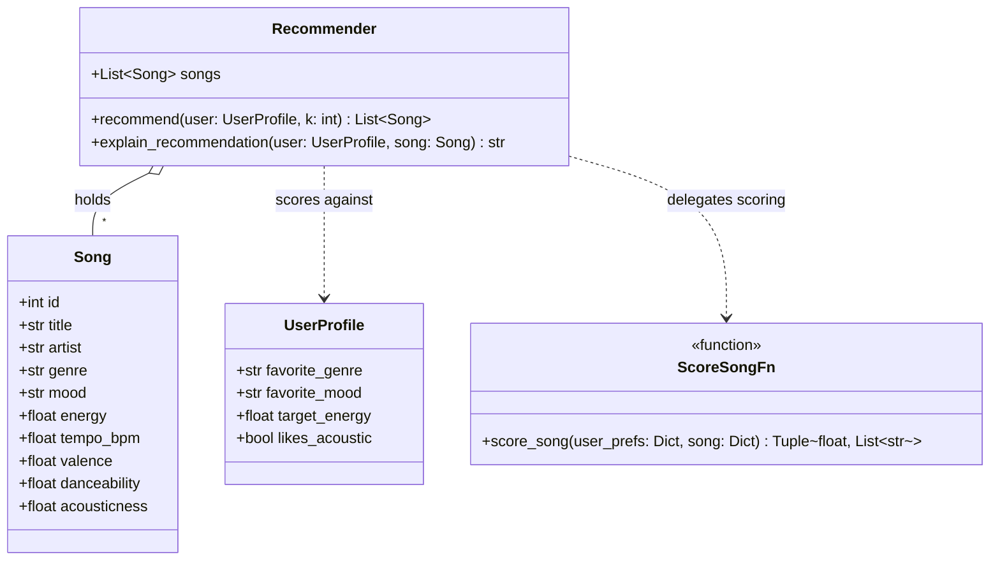
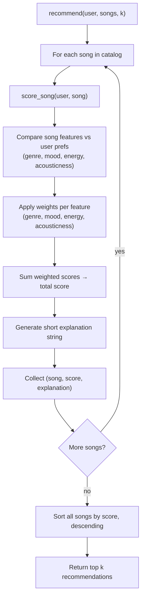

# 🎵 Music Recommender Simulation

## Project Summary

In this project you will build and explain a small music recommender system.

Your goal is to:

- Represent songs and a user "taste profile" as data
- Design a scoring rule that turns that data into recommendations
- Evaluate what your system gets right and wrong
- Reflect on how this mirrors real world AI recommenders

Replace this paragraph with your own summary of what your version does.

---

## How The System Works

Each `Song` carries five core numeric features — `energy`, `tempo_bpm`, `valence`, `danceability`, and `acousticness` — plus `genre` and `mood` tags used for categorical matching.

Each `UserProfile` stores a listener's taste as `favorite_genre`, `favorite_mood`, a `target_energy` value, and a `likes_acoustic` flag.

The `Recommender` scores every song against a user profile with a weighted rule:

- **Genre match**: a bonus if the song's `genre` equals the user's `favorite_genre`.
- **Mood match**: a bonus if the song's `mood` equals the user's `favorite_mood`.
- **Energy fit**: the closer the song's `energy` is to the user's `target_energy`, the higher the score (distance-based penalty).
- **Acousticness fit**: a flat bonus when the song's `acousticness` crosses a threshold in the direction the user prefers — high `acousticness` if `likes_acoustic` is true, low `acousticness` otherwise.

`valence`, `danceability`, and `tempo_bpm` are carried on every `Song` but are not currently read by the scoring rule.

Each weighted component also produces a short piece of text (e.g. `"matches favorite genre"`, `"energy close to target"`), which are joined into the explanation returned by `explain_recommendation`.

To choose recommendations, the system scores every song in the catalog this way, sorts all songs by total score in descending order, and returns the top `k`.

**Class structure:**



**Scoring and recommendation flow:**



---

## Getting Started

### Setup

1. Create a virtual environment (optional but recommended):

   ```bash
   python -m venv .venv
   source .venv/bin/activate      # Mac or Linux
   .venv\Scripts\activate         # Windows

2. Install dependencies

```bash
pip install -r requirements.txt
```

3. Run the app:

```bash
python -m src.main
```

### Running Tests

Run the starter tests with:

```bash
pytest
```

You can add more tests in `tests/test_recommender.py`.

---

## Sample Recommendation Output

Paste a sample of your recommender's output here as a text block so a reader can see what it produces:

```
=== High Energy Pop ===

Top recommendations:

Sunrise City by Neon Echo - Score: 4.97
Reason: The genre (pop) matches your favorite (+2.00); the mood (happy) matches your favorite (+1.00); its energy (0.82) closely matches your target (0.80) (+1.47); its produced/non-acoustic sound (0.18) fits your preference (+0.50).

Gym Hero by Max Pulse - Score: 3.80
Reason: The genre (pop) matches your favorite (+2.00); its energy (0.93) closely matches your target (0.80) (+1.30); its produced/non-acoustic sound (0.05) fits your preference (+0.50).

Sunlit Polaroids by Indigo Parade - Score: 2.97
Reason: The mood (happy) matches your favorite (+1.00); its energy (0.78) closely matches your target (0.80) (+1.47); its produced/non-acoustic sound (0.30) fits your preference (+0.50).

Concrete Crown by Silver District - Score: 1.97
Reason: Its energy (0.82) closely matches your target (0.80) (+1.47); its produced/non-acoustic sound (0.12) fits your preference (+0.50).

Midnight Roses by Sol del Barrio - Score: 1.94
Reason: Its energy (0.84) closely matches your target (0.80) (+1.44); its produced/non-acoustic sound (0.32) fits your preference (+0.50).


=== Chill Lofi ===

Top recommendations:

Library Rain by Paper Lanterns - Score: 5.00
Reason: The genre (lofi) matches your favorite (+2.00); the mood (chill) matches your favorite (+1.00); its energy (0.35) closely matches your target (0.35) (+1.50); its acoustic sound (0.86) fits your preference for acoustic tracks (+0.50).

Midnight Coding by LoRoom - Score: 4.89
Reason: The genre (lofi) matches your favorite (+2.00); the mood (chill) matches your favorite (+1.00); its energy (0.42) closely matches your target (0.35) (+1.40); its acoustic sound (0.71) fits your preference for acoustic tracks (+0.50).

Focus Flow by LoRoom - Score: 3.92
Reason: The genre (lofi) matches your favorite (+2.00); its energy (0.40) closely matches your target (0.35) (+1.42); its acoustic sound (0.78) fits your preference for acoustic tracks (+0.50).

Spacewalk Thoughts by Orbit Bloom - Score: 2.90
Reason: The mood (chill) matches your favorite (+1.00); its energy (0.28) closely matches your target (0.35) (+1.40); its acoustic sound (0.92) fits your preference for acoustic tracks (+0.50).

Coffee Shop Stories by Slow Stereo - Score: 1.97
Reason: Its energy (0.37) closely matches your target (0.35) (+1.47); its acoustic sound (0.89) fits your preference for acoustic tracks (+0.50).


=== Sad Acoustic Folk ===

Top recommendations:

Autumn Window by Maple & Hollow - Score: 4.97
Reason: The genre (folk) matches your favorite (+2.00); the mood (sad) matches your favorite (+1.00); its energy (0.32) closely matches your target (0.30) (+1.47); its acoustic sound (0.94) fits your preference for acoustic tracks (+0.50).

Clair de Lune by Claude Debussy - Score: 2.00
Reason: Its energy (0.30) closely matches your target (0.30) (+1.50); its acoustic sound (0.94) fits your preference for acoustic tracks (+0.50).

Spacewalk Thoughts by Orbit Bloom - Score: 1.97
Reason: Its energy (0.28) closely matches your target (0.30) (+1.47); its acoustic sound (0.92) fits your preference for acoustic tracks (+0.50).

Library Rain by Paper Lanterns - Score: 1.92
Reason: Its energy (0.35) closely matches your target (0.30) (+1.42); its acoustic sound (0.86) fits your preference for acoustic tracks (+0.50).

Coffee Shop Stories by Slow Stereo - Score: 1.90
Reason: Its energy (0.37) closely matches your target (0.30) (+1.40); its acoustic sound (0.89) fits your preference for acoustic tracks (+0.50).
```

**Screenshot or video** *(optional)*: <!-- Insert a screenshot or demo video link here -->

---

## Experiments You Tried

**Experiment 1 — doubled energy weight, halved genre weight** (`GENRE_MATCH_POINTS: 2.0 → 1.0`, `ENERGY_MAX_POINTS: 1.5 → 3.0`, run temporarily then reverted):\
All scores shifted upward (energy's max contribution is now bigger than genre's), but the more important effect was **reordering**, not just rescaling. Whenever a song had a close energy match but no genre match, it could now leapfrog a song with a genre match but a worse energy fit. For example, in "High Energy Pop" the baseline order was `Sunrise City (genre+mood match) > Gym Hero (genre match) > Sunlit Polaroids (mood match)`; with the new weights it became `Sunrise City > Sunlit Polaroids > Gym Hero` — a pure energy/mood song jumped ahead of a genre-matching song. The same flip showed up in the "Contradictory Chill Rager" edge-case profile: three energy-only matches (no genre or mood match) pushed the mood-matching "Midnight Coding" down from rank 2 to rank 4. This confirms genre match was acting as the dominant tie-breaker before, and energy similarity becomes the dominant signal once its weight exceeds genre's.

**Experiment 2 — mood check commented out** (temporarily disabled, then restored):\
With the mood bonus removed, songs that only matched on mood (with a mediocre energy fit) lost their only source of points and fell out of the top 5 entirely. This was clearest in the "Contradictory Chill Rager" edge case: two "chill"-mood songs (Midnight Coding, Library Rain) that ranked #2 and #3 in the baseline (propped up purely by the mood + acoustic bonuses, since their energy was far from the user's 0.95 target) disappeared from the top 5 once mood stopped contributing, replaced by songs with no thematic connection to the user at all — just a coincidentally close energy value. It also caused minor reordering among near-tied songs even without genre involved (e.g., "Chill Lofi": Midnight Coding and Focus Flow swapped rank 2/3 once mood's flat +1.0 no longer separated them, leaving their slightly different energy fits as the tie-breaker).

**Takeaway:** the ranking is sensitive mostly to whichever signal has the largest point budget relative to the others — genre dominates by default, but energy or mood can each become the deciding factor once weighted competitively. Songs whose *only* redeeming quality is a categorical match (mood or genre) are fragile: they rely entirely on that one bonus to stay in the top-k, and removing or shrinking it can knock them out even though nothing about the song itself changed.

---

## Limitations and Risks

Summarize some limitations of your recommender.

Examples:

- It only works on a tiny catalog
- It does not understand lyrics or language
- It might over favor one genre or mood

You will go deeper on this in your model card.

---

## Reflection

Read and complete `model_card.md`:

[**Model Card**](model_card.md)

Write 1 to 2 paragraphs here about what you learned:

- about how recommenders turn data into predictions
- about where bias or unfairness could show up in systems like this


