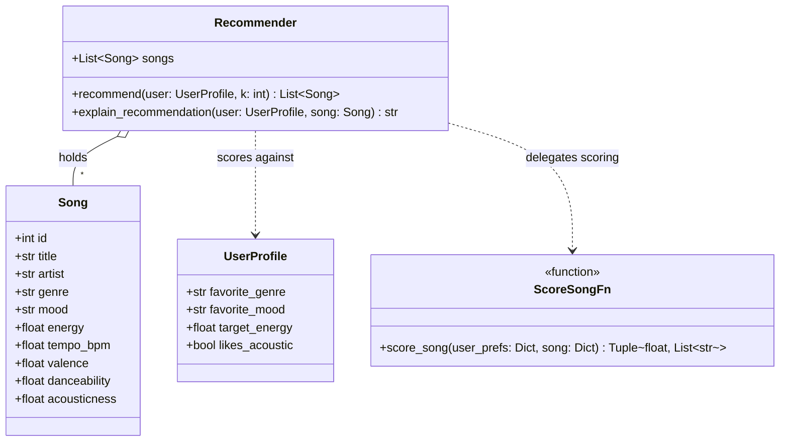
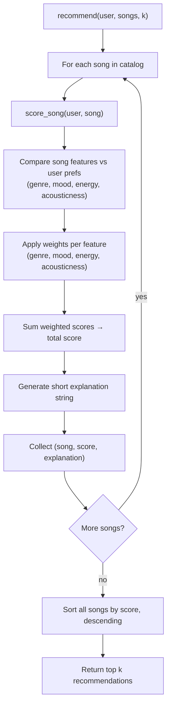

# 🎵 Music Recommender Simulation

## Project Summary

This project builds a simple music recommender system using a CSV song catalog. The catalog is stored in `data/songs.csv`, which contains song metadata such as title, artist, genre, mood, energy, tempo, valence, danceability, and acousticness. The project does not store the actual music files.

The `load_songs` function in `src/recommender.py` reads the CSV file and converts each row into a dictionary or `Song` object. The recommender then compares each song's features with a user's profile and uses a scoring rule to decide which songs should be recommended.

To test the scoring rule, `src/main.py` runs it against 13 sample user profiles: 10 realistic taste profiles, plus 3 adversarial edge cases (conflicting preferences, an extreme energy value, and a genre/mood that doesn't exist in the catalog) meant to probe how the scoring holds up under unusual input.

---

## How The System Works

Each `Song` carries five core numeric features — `energy`, `tempo_bpm`, `valence`, `danceability`, and `acousticness` — plus `genre` and `mood` tags used for categorical matching.

Each `UserProfile` stores a listener's taste as `favorite_genre`, `favorite_mood`, a `target_energy` value, and a `likes_acoustic` flag.

The `Recommender` scores every song against a user profile with a weighted rule:

- **Genre match**: a `+2.00` bonus if the song's `genre` equals the user's `favorite_genre`.
- **Mood match**: a `+1.00` bonus if the song's `mood` equals the user's `favorite_mood`.
- **Energy fit**: up to `+1.50`, scaled by how close the song's `energy` is to the user's `target_energy` (distance-based penalty — the further apart, the fewer points).
- **Acousticness fit**: a flat `+0.50` bonus when the song's `acousticness` crosses a threshold in the direction the user prefers — high `acousticness` if `likes_acoustic` is true, low `acousticness` otherwise.

`valence`, `danceability`, and `tempo_bpm` are carried on every `Song` but are not currently read by the scoring rule.

Each weighted component also produces a short piece of text (e.g. `"matches favorite genre"`, `"energy close to target"`), which are joined into the explanation returned by `explain_recommendation`.

To choose recommendations, the system scores every song in the catalog this way, sorts all songs by total score in descending order, and returns the top `k`.

**Class structure:**



**Scoring and recommendation flow:**



---

## Getting Started

### Setup

1. Create a virtual environment (optional but recommended):

   ```bash
   python -m venv .venv
   source .venv/bin/activate      # Mac or Linux
   .venv\Scripts\activate         # Windows

2. Install dependencies

```bash
pip install -r requirements.txt
```

3. Run the app:

```bash
python -m src.main
```

### Running Tests

Run the starter tests with:

```bash
pytest
```

You can add more tests in `tests/test_recommender.py`.

---

## Sample Recommendation Output

```
=== High Energy Pop ===

Top recommendations:

Sunrise City by Neon Echo - Score: 4.97
Reason: The genre (pop) matches your favorite (+2.00); the mood (happy) matches your favorite (+1.00); its energy (0.82) closely matches your target (0.80) (+1.47); its produced/non-acoustic sound (0.18) fits your preference (+0.50).

Gym Hero by Max Pulse - Score: 3.80
Reason: The genre (pop) matches your favorite (+2.00); its energy (0.93) closely matches your target (0.80) (+1.30); its produced/non-acoustic sound (0.05) fits your preference (+0.50).

Sunlit Polaroids by Indigo Parade - Score: 2.97
Reason: The mood (happy) matches your favorite (+1.00); its energy (0.78) closely matches your target (0.80) (+1.47); its produced/non-acoustic sound (0.30) fits your preference (+0.50).

Concrete Crown by Silver District - Score: 1.97
Reason: Its energy (0.82) closely matches your target (0.80) (+1.47); its produced/non-acoustic sound (0.12) fits your preference (+0.50).

Midnight Roses by Sol del Barrio - Score: 1.94
Reason: Its energy (0.84) closely matches your target (0.80) (+1.44); its produced/non-acoustic sound (0.32) fits your preference (+0.50).


=== Chill Lofi ===

Top recommendations:

Library Rain by Paper Lanterns - Score: 5.00
Reason: The genre (lofi) matches your favorite (+2.00); the mood (chill) matches your favorite (+1.00); its energy (0.35) closely matches your target (0.35) (+1.50); its acoustic sound (0.86) fits your preference for acoustic tracks (+0.50).

Midnight Coding by LoRoom - Score: 4.89
Reason: The genre (lofi) matches your favorite (+2.00); the mood (chill) matches your favorite (+1.00); its energy (0.42) closely matches your target (0.35) (+1.40); its acoustic sound (0.71) fits your preference for acoustic tracks (+0.50).

Focus Flow by LoRoom - Score: 3.92
Reason: The genre (lofi) matches your favorite (+2.00); its energy (0.40) closely matches your target (0.35) (+1.42); its acoustic sound (0.78) fits your preference for acoustic tracks (+0.50).

Spacewalk Thoughts by Orbit Bloom - Score: 2.90
Reason: The mood (chill) matches your favorite (+1.00); its energy (0.28) closely matches your target (0.35) (+1.40); its acoustic sound (0.92) fits your preference for acoustic tracks (+0.50).

Coffee Shop Stories by Slow Stereo - Score: 1.97
Reason: Its energy (0.37) closely matches your target (0.35) (+1.47); its acoustic sound (0.89) fits your preference for acoustic tracks (+0.50).


=== Sad Acoustic Folk ===

Top recommendations:

Autumn Window by Maple & Hollow - Score: 4.97
Reason: The genre (folk) matches your favorite (+2.00); the mood (sad) matches your favorite (+1.00); its energy (0.32) closely matches your target (0.30) (+1.47); its acoustic sound (0.94) fits your preference for acoustic tracks (+0.50).

Clair de Lune by Claude Debussy - Score: 2.00
Reason: Its energy (0.30) closely matches your target (0.30) (+1.50); its acoustic sound (0.94) fits your preference for acoustic tracks (+0.50).

Spacewalk Thoughts by Orbit Bloom - Score: 1.97
Reason: Its energy (0.28) closely matches your target (0.30) (+1.47); its acoustic sound (0.92) fits your preference for acoustic tracks (+0.50).

Library Rain by Paper Lanterns - Score: 1.92
Reason: Its energy (0.35) closely matches your target (0.30) (+1.42); its acoustic sound (0.86) fits your preference for acoustic tracks (+0.50).

Coffee Shop Stories by Slow Stereo - Score: 1.90
Reason: Its energy (0.37) closely matches your target (0.30) (+1.40); its acoustic sound (0.89) fits your preference for acoustic tracks (+0.50).
```

**Screenshot or video** *(optional)*: <!-- Insert a screenshot or demo video link here -->

---

## Experiments You Tried

**Experiment 1 — doubled energy weight, halved genre weight** (`GENRE_MATCH_POINTS: 2.0 → 1.0`, `ENERGY_MAX_POINTS: 1.5 → 3.0`, run temporarily then reverted):\
All scores shifted upward (energy's max contribution is now bigger than genre's), but the more important effect was **reordering**, not just rescaling. Whenever a song had a close energy match but no genre match, it could now leapfrog a song with a genre match but a worse energy fit. For example, in "High Energy Pop" the baseline order was `Sunrise City (genre+mood match) > Gym Hero (genre match) > Sunlit Polaroids (mood match)`; with the new weights it became `Sunrise City > Sunlit Polaroids > Gym Hero` — a pure energy/mood song jumped ahead of a genre-matching song. The same flip showed up in the "Contradictory Chill Rager" edge-case profile: three energy-only matches (no genre or mood match) pushed the mood-matching "Midnight Coding" down from rank 2 to rank 4. This confirms genre match was acting as the dominant tie-breaker before, and energy similarity becomes the dominant signal once its weight exceeds genre's.

**Experiment 2 — mood check commented out** (temporarily disabled, then restored):\
With the mood bonus removed, songs that only matched on mood (with a mediocre energy fit) lost their only source of points and fell out of the top 5 entirely. This was clearest in the "Contradictory Chill Rager" edge case: two "chill"-mood songs (Midnight Coding, Library Rain) that ranked #2 and #3 in the baseline (propped up purely by the mood + acoustic bonuses, since their energy was far from the user's 0.95 target) disappeared from the top 5 once mood stopped contributing, replaced by songs with no thematic connection to the user at all — just a coincidentally close energy value. It also caused minor reordering among near-tied songs even without genre involved (e.g., "Chill Lofi": Midnight Coding and Focus Flow swapped rank 2/3 once mood's flat +1.0 no longer separated them, leaving their slightly different energy fits as the tie-breaker).

**Takeaway:** the ranking is sensitive mostly to whichever signal has the largest point budget relative to the others — genre dominates by default, but energy or mood can each become the deciding factor once weighted competitively. Songs whose *only* redeeming quality is a categorical match (mood or genre) are fragile: they rely entirely on that one bonus to stay in the top-k, and removing or shrinking it can knock them out even though nothing about the song itself changed.

---

## Limitations and Risks

- **Tiny catalog (18 songs)**: there isn't enough coverage per genre/mood/energy combination to give any user profile a truly varied top-5 — some queries return near-duplicate songs by the same artist (e.g. `Neon Echo`, `LoRoom` each appear twice) simply because there's nothing else to fill the slot.
- **No understanding of the actual audio, lyrics, or language** — the model only ever compares metadata tags (`genre`, `mood`) and hand-labeled numeric features (`energy`, `acousticness`). Two songs tagged the same genre could sound nothing alike, and the system has no way to know that.
- **Genre and energy are correlated in the dataset and both heavily weighted**, so they reinforce each other instead of counterbalancing: high-energy genres (pop, rock, metal, EDM) and low-energy genres (lofi, ambient, jazz, classical) rarely overlap, meaning a user's genre preference and energy preference tend to point at the same narrow slice of the catalog rather than surfacing variety.
- **No diversity or exploration mechanism** — `recommend()` just sorts by score and slices the top `k`, with no cap on repeated artists/genres and no randomness, so the same profile always gets the same answer and never gets nudged toward something adjacent to its stated taste.
- **The scoring can't detect contradictory preferences.** As shown in the "Contradictory Chill Rager" experiment (see `model_card.md`), a profile that mixes `favorite_genre="metal"` with `favorite_mood="chill"` still ranks an angry metal track #1, because genre and energy points are summed independently of mood rather than checked for overall coherence.
- **Mood tags are almost all unique per song** in this catalog, so the mood bonus rarely fires and can't meaningfully counterbalance genre or energy — meaning the system may unintentionally favor whichever axis (genre, then energy) happens to carry the most weight for a given user.

You will go deeper on this in your model card.

---

## Reflection

[**Model Card**](model_card.md)

Building this made it clear that a "recommendation" is really just a sorted list of numbers — the system never understands a song, it just adds up points for how well a few tags and features line up with what a profile stated, then hands back whichever rows scored highest. There's no magic in the prediction step: `genre == favorite_genre` is either true or false, `energy` distance is a subtraction, and the four resulting numbers get summed into one score with no weighing of confidence or context. That additive-and-sort structure is powerful because it's transparent and debuggable (you can always point to exactly which rule earned which points), but it also means the system is only ever as good as which features got weighted and by how much — it can't reason about a song, it can only reward the specific similarities someone decided to measure.

That same structure is also where bias creeps in, and testing with adversarial profiles made it obvious rather than theoretical. Because genre (+2.00) and energy (up to +1.50) carry more weight than mood (+1.00), the "Contradictory Chill Rager" test showed the system confidently recommending an angry metal track to someone who asked for "chill" — the scoring had no concept that mood was a hard constraint, only a smaller bonus that lost to genre and energy. The "Nonexistent Genre Ghost" test showed a second, subtler failure mode: when a user's stated genre or mood doesn't exist in the catalog, the system doesn't flag that mismatch, it just silently zeroes out those signals and quietly falls back to ranking by whichever feature is left (energy) — so a user with an unusual or misspelled preference gets a confidently-presented top-5 with no indication that most of their input was ignored. Neither failure required bad data or a bug; both came directly from how the weights were chosen and from treating "no match" the same as "no opinion." That's the bigger lesson for real-world systems: unfairness in a recommender doesn't require intent or a corrupted dataset — it can be baked entirely into which signals get the most points and how confidently the system reports results it's actually unsure about.


